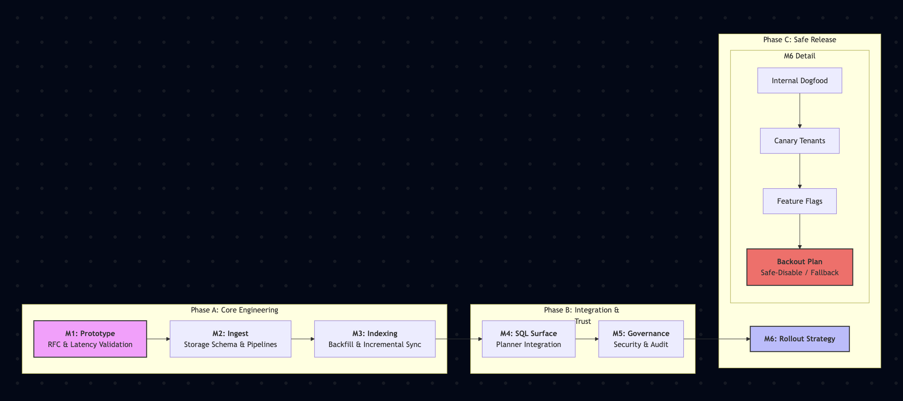

### Interview micro‑project:
###  Document Analytics + Search in Snowflake-like Platform

Add first-class support for **document data** (PDFs, docs, text blobs) alongside **tables and semi‑structured data**, so users can:

* Ingest documents (batch + streaming).
* Store them securely in the **storage layer** (central repository / object storage).
* Extract text/metadata (optional).
* Query via SQL in **compute warehouses**:
  * Full-text search (“contains”, “match”).
  * Metadata filters (author/date/type).
  * Optional semantic (embedding) search.
* Enforce governance/security in **cloud services** (catalog, ACLs, auditing, compliance).

This single micro‑project naturally exercises: storage decisions, query engine integration, metadata/catalog, execution plan changes, and operational rollout—exactly the competencies your interview excerpt lists.

---

## 1) Sentence-by-sentence analysis of the interview prompt

### Sentence 1

> “We want to understand how you will make and have made technology choices, articulate and communicate, elicit requirements, thinking of build vs. buy/open source, build for short-term/long-term, design systems, how to turn requirements into a long-term vision, execution of the project.”

This is a *bundle* of evaluation criteria. Below, I break it into clauses and map each to **(a) what they want**, **(b) response classifications**, and **(c) Snowflake-like concrete content** (using the micro‑project).

---

## 2) Clause-by-clause requirements and “response classifications” in the Snowflake-like context

### 2.1 “How you will make and have made technology choices”

**What they want**

* A repeatable decision framework.
* Evidence you’ve chosen technologies under real constraints.
* Comfort with the *platform reality* implied by the excerpt: separation of storage/compute, multi-tenant service, centralized metadata services, etc.

**Response classifications that work best**

* **Past case study (evidence-based)** + **Tradeoff analysis (options/criteria)**
* Plus a **future framework** (“how I’d do it here”)

**Concrete Snowflake-like example content (Document Analytics micro‑project)**

* Choosing where document text and indexes live:

  * **Option A:** Store extracted text in a “Snowflake table”-like columnar format; store index separately.
  * **Option B:** Store document metadata in tables, raw docs as FILE/unstructured objects, index in an index service.
  * **Option C:** Push indexing/querying to an external engine (buy) and integrate.

* Decision criteria you can explicitly state:

  * Latency targets (interactive search vs batch analysis)
  * Cost per TB and cost per query
  * Multi-tenant isolation (one warehouse shouldn’t degrade others)
  * Operational burden (patching, upgrades, incidents)
  * Security model (row-level / object-level access)
  * “Cloud services” integration needs (catalog, auth, auditing)

**Signals they love**

* “We ran a POC to compare indexing approaches under realistic corpus sizes and concurrency.”
* “We defined success metrics (p95 latency, index freshness, cost/query) and used them to decide.”

---

### 2.2 “Articulate and communicate”

**What they want**

* Clear, structured communication across audiences.
* You can “speak architecture” and also “speak product.”

**Response classifications**

* **Communication proof** via artifacts + the way you answer
* “Structure under pressure” matters here.

**Concrete Snowflake-like content**

* Artifacts you’d produce for this micro‑project:

  * **1‑page exec summary:** user value + cost + risks
  * **RFC/design doc:** architecture (storage/compute/cloud services), APIs, data model, rollout
  * **ADR(s):** e.g., “Index storage format decision”
  * **Threat model:** doc access + exfiltration risk
  * **Operational readiness:** dashboards, alerts, SLOs, runbooks

**Signals**

* You can narrate the Snowflake-like layering cleanly:

  * *Storage layer* (central repository)
  * *Compute layer* (independent virtual warehouses)
  * *Cloud services* (auth, catalog, metadata, query planning/dispatch)

---

### 2.3 “Elicit requirements”

**What they want**

* You can turn fuzzy asks into testable specs—especially **non-functional requirements** (NFRs), which dominate data platforms.

**Response classifications**

* **Requirements elicitation framework** + **examples of questions you ask**
* Bonus: show you understand platform personas (data engineers vs analysts vs ML).

**Concrete requirements elicitation questions for the micro‑project**
Ask questions that prove you understand **warehouse + analytics engine realities**:

**Workloads & UX**

* Is this primarily:

  * interactive search (“type and see results in seconds”), or
  * batch document analytics (minutes/hours), or both?
* What query patterns?

  * keyword search, phrase queries, filters, joins with tables?

**Scale**

* Corpus size (GB/TB), document count, average doc size
* Ingest rate (docs/min), update/delete frequency

**Freshness**

* Acceptable lag: “index searchable within X minutes”
* Must it support streaming ingestion (Snowpipe Streaming-like)?

**Security & governance**

* Tenant isolation requirements
* Fine-grained access controls (per document? per folder? per row?)
* Audit logging requirements

**Reliability**

* Availability target (SLO)
* Backfill/reindex strategy
* Disaster recovery / replication requirements (Snowgrid-like cross-region replication, if in scope)

**Cost**

* Budget constraints: storage overhead of indexes, compute overhead for extraction and search
* Who pays: shared service vs per-warehouse billing model?

**Acceptance criteria (what “done” means)**

* “p95 search latency < 2s for 95% of queries at N concurrent users”
* “Index freshness < 5 minutes”
* “Supports document-level ACLs; unauthorized docs never appear in results”
* “Rollout with zero downtime; backout plan exists”

---

### 2.4 “Thinking of build vs. buy/open source”

**What they want**

* You won’t reinvent commodity pieces.
* You understand licensing, supply chain security, operational costs, and vendor lock-in.

**Response classifications**

* **Decision matrix** + **TCO framing**
* “Exit strategy” is a strong differentiator.

**Concrete Snowflake-like content for this micro‑project**
You might evaluate:

* **Build** an internal indexing service (tight integration, consistent security model).
* **Open source** libraries for indexing/querying (faster than writing from scratch).
* **Buy/managed** search service (fastest, but potential lock-in / policy concerns).

Your criteria should include:

* Multi-tenant isolation
* Compliance obligations
* Latency under load
* Upgrade and patch cadence
* Operational ownership (on-call burden)
* Data residency constraints

**What to say that scores**

* “We can start with an open-source indexing library embedded in a service, but define a clean interface so we can swap implementation later.”
* “We document the exit plan: index rebuild tooling + portable index schema.”

---

### 2.5 “Build for short-term/long-term”

**What they want**

* You can ship an MVP **without** creating an unpayable architectural debt bomb.
* You can name tradeoffs explicitly and manage them.

**Response classifications**

* **Phased design (MVP → v2)** + **intentional debt management**

**Concrete Snowflake-like MVP plan**
**MVP (4–8 weeks scope, conceptually)**

* Support document ingest + metadata table
* Extract text for a subset of formats (e.g., plain text / PDF)
* Full-text search (basic ranking)
* SQL surface: `SEARCH()` function or `WHERE CONTAINS(text, ...)`
* Security: document-level ACL enforcement
* Observability: query latency, index lag, error rates

**Long-term evolution**

* Semantic search (embeddings)
* Incremental indexing + deletes
* Better ranking, language support
* Query planner optimizations (pushdown, pruning)
* Cross-region replication of indexes
* Unified governance/catalog integration (lineage, policies)

**Strong signal phrasing**

* “MVP meets the core value; architecture keeps the index interface stable so we can evolve ranking and storage without breaking SQL semantics.”

---

### 2.6 “Design systems”

**What they want**

* Real distributed systems thinking: 
  * failure modes, 
  * scaling, 
  * caching, 
  * concurrency, 
  * isolation, 
  * observability.

* In Snowflake-like systems: strong attention to **storage/compute separation** and **cloud services orchestration**.

**Response classifications**

* **System design walkthrough** (components + data flows + failure handling)

**Concrete Snowflake-like architecture for the micro‑project**
A crisp design that mirrors the excerpt’s layers:

**Storage layer**

* Raw documents stored in central object storage
* Metadata stored in internal optimized tables (columnar)
* Optional extracted text stored as columnar (for analytics scans)

**Compute layer (virtual warehouses)**

* Executes SQL queries
* Calls into:

  * full-text search operator (index access), and/or
  * scan/extract operators for analytics workloads

**Cloud services layer**

* AuthN/AuthZ, auditing
* Catalog entries: document collections, schemas, searchable fields
* Query parsing/optimization:

  * recognizes `SEARCH()` predicate
  * plans index lookup + filter + join
* Task orchestration:

  * ingestion notifications (Snowpipe-like)
  * indexing jobs, retry policy

**Key design details interviewers expect**

* Index placement strategy:

  * stored centrally vs cached per-warehouse

* Concurrency model:

  * isolate “index build” from “search queries” workloads

* Failure modes:

  * partial indexing,
  * corrupt doc,
  * retry storms,
  * backpressure.

* Observability:

  * index lag metric, 
  * p95/p99 search latency, 
  * cache hit ratio.

---

### 2.7 “How to turn requirements into a long-term vision”

**What they want**

* You can build a roadmap that aligns with platform strategy.
* You understand how features become “platform primitives.”

**Response classifications**

* **North-star vision** + **sequenced roadmap** + **platform leverage**

**Concrete long-term vision framing**
Position “Document Analytics” as a platform capability:

* Near term: “search + governance” (unblocks analysts and app teams)
* Mid term: unify with semi-structured querying (JSON) and structured joins
* Long term: “bring compute to data” for AI workflows (run extraction/classification inside the platform), consistent with the excerpt’s integrated workloads approach

A strong roadmap format:

* Phase 1: secure ingestion + basic search
* Phase 2: indexing optimizations + planner integration
* Phase 3: semantic + multimodal + cross-region replication + richer governance

---

### 2.8 “Execution of the project”

**What they want**

* You can deliver safely in a production SaaS platform.
* You can manage risk, rollout, backwards compatibility, and operational readiness.

**Response classifications**

* **Execution narrative** (milestones, rollout plan, risk management) + **operational maturity**

**Concrete execution plan (micro‑project)**

* **Milestone 1:** RFC + prototype (prove latency + correctness)
* **Milestone 2:** Storage schema + ingest pipeline (batch + streaming path)
* **Milestone 3:** Indexer service + backfill + incremental updates
* **Milestone 4:** SQL surface + planner integration
* **Milestone 5:** Security + audit + governance
* **Milestone 6:** Gradual rollout

  * internal dogfood
  * canary tenants
  * feature flags
  * backout plan (disable index usage, fall back to scan or return “feature unavailable” safely)

**Metrics you’d commit to**

* Search p95 latency
* Index freshness lag
* Cost per indexed GB
* Incident rate / MTTR once live

---

## 3) Sentence 2 analysis: process, team, contributions, impact over time

### Sentence 2

> “This will be a deeper dive into your process, team, contributions and how you impacted the project over time.”

They are explicitly warning you: **don’t only pitch architecture**—they want **how you work**, how you lead, and sustained results.

---

### 3.1 “Deeper dive into your process”

**Vocabulary**
1. NFR: Non-Functional Requirement
* While "Functional Requirements" define what a system does (e.g., "The user can log in"), NFRs define how the system performs or behaves.
* Focus: The "ilities"—Scalability, Availability, Reliability, Maintainability, and Security.
* Example: "The system must handle 10,000 concurrent requests (Scalability) with a P95 latency of <200ms (Performance)."
2. ADR: Architecture Decision Record
* An ADR is a short text document that captures a significant architectural decision made during a project, including the context and the consequences.
* Focus: Documentation and "Why." It prevents future engineers from wondering why a specific technology or pattern was chosen (and prevents them from reverting it without understanding the trade-offs).
* Example: "ADR-005: We will use a Shared-Nothing architecture instead of a Full-Crossbar to ensure linear scalability."
3. SLO: Service Level Objective
* An SLO is a specific target level for the reliability of a service. It is a key component of the SRE framework.
* Focus: Measurement. It is built upon SLIs (Service Level Indicators, like "Request Latency").
* Example: "99.9% of all successful requests must be served in less than 500ms over a rolling 30-day window."
4. SRE: Site Reliability Engineering
* Originally coined by Google, SRE is a discipline that applies software engineering mindsets to IT operations.
* Focus: Automation and Reliability. SREs use software to manage systems, solve problems, and automate operational tasks (like deployments or scaling) that were previously done manually.
* Key Concept: The Error Budget. If a team meets its SLOs, they can ship new features quickly; if they exhaust their error budget, they must stop shipping and focus on reliability.

**Summary Table**
| Acronym | Role in the Lifecycle | Primary Purpose |
| :------ | :-------------------- | :-------------- |
| NFR | Design Phase | Defining the constraints and quality of the system. |
| ADR | Design/Development| Documenting the "Why" behind the architecture. |
| SLO | Production/Ops | Setting clear goals for what "reliable" looks like. |
| SRE | Operations/Scale | Using code to ensure the system meets its SLOs. |

**Connecting the Dots**
In your project, you might define an NFR for low-latency streaming, document the choice of storage in an ADR, set an SLO to measure that latency in production, and have an SRE build the automation to ensure that SLO is maintained as you scale.

**Response classifications**

* **Repeatable process** (discovery → design → build → validate → iterate)

**Concrete process in this platform**

* Start with workload characterization + NFRs (latency, cost, isolation)
* Prototype the riskiest part early (index lookup integration with query planner)
* Write RFC + ADRs to make decisions durable
* Define SLOs and ship with observability

---

### 3.2 “Team”

**Response classifications**

* **Collaboration and influence**: how you align cloud services, storage, compute, security, and product

**Concrete team map for this micro‑project**

* Storage team (object storage integration, table formats)
* Query engine team (planner, execution operators)
* Cloud services team (catalog, security, metadata)
* SRE/Infra (rollout, monitoring)
* Product/UX (Snowsight-like UI hooks if relevant)

What to demonstrate:

* How you negotiated interfaces and ownership boundaries
* How you prevented cross-team deadlocks (DRIs, milestones, integration tests)

---

### 3.3 “Your contributions”

**Response classifications**

* **Clear “I did X”** statements, not vague “we”

Concrete examples:

* “I authored the RFC and drove the decision on index storage vs per-warehouse caching.”
* “I built the initial prototype operator and benchmarked it under concurrency.”
* “I defined the SLOs and dashboards and led the production readiness review.”

---

### 3.4 “Impacted the project over time”

**Response classifications**

* **Before/after trajectory** with metrics and learning loops

Concrete impact story:

* Launch v1 → observe bottlenecks → optimize pruning/caching → reduce p95 latency
* Improve indexer reliability → reduce lag and incident count
* Enable additional formats and workloads over time

---

## 4) A “micro‑project answer pack” you can bring to the interview

If the interviewer says “walk me through your approach,” this is a compact structure that hits nearly everything:

1. **Context**: multi-tenant SaaS, storage/compute separation, cloud services orchestrating
2. **Requirements**: functional + NFRs (latency, freshness, security, cost, isolation)
3. **Options**: build/buy/open source + where each fits
4. **Decision**: criteria, tradeoffs, risks, and mitigations
5. **Design**: components in storage/compute/cloud services; data flow; failure modes
6. **Execution**: milestones, rollout plan, observability, backout
7. **Long-term vision**: platform primitive + roadmap phases
8. **Your role & impact**: what you drove, metrics improved over time

---

## 5) If you want to go even more “Snowflake-like”: three alternate micro-project choices

If “document analytics” isn’t the micro‑project they’re hinting at, these are equally Snowflake-relevant and map well to the same interview criteria:

1. **Micro-partition pruning for semi-structured columns**
   Improve query performance by enhancing statistics/pruning for JSON/XML fields.

2. **Iceberg table integration enhancements**
   Improve external table metadata refresh, caching, and consistency under concurrent writes.

3. **Hybrid table feature slice (transactional + analytical)**
   Add a small transactional capability (locking/constraints) while enabling analytical scans.

Each of these still exercises storage/compute/cloud services boundaries.

